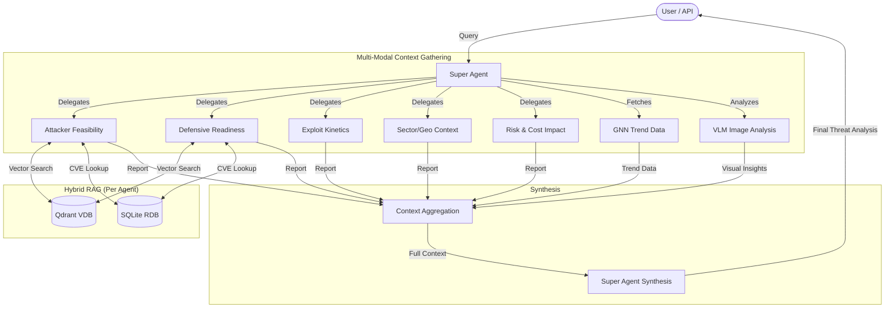

# Agent Architecture & Flow

This document details the multi-agent architecture of the Cyber Security RAG System, including the **Hybrid RAG** approach that combines structured relational data (RDB) with vectorized knowledge (VDB).

## Agent Descriptions

The system consists of **5 Specialized Research Agents** and **1 Super Agent**.

| Agent Name | ID | Role & Description | Knowledge Base(s) |
| :--- | :--- | :--- | :--- |
| **Attacker Feasibility** | `attacker_feasibility` | **Offensive Researcher**: Analyzes the technical feasibility of attacks, considering complexity and available exploits. | `cyber_intel_full` |
| **Defensive Readiness** | `defensive_readiness` | **Defensive Specialist**: Evaluates the organization's preparedness, security policies, and infrastructure logs. | `cyber_intel_full` |
| **Exploit Kinetics** | `exploit_kinetics` | **Threat Intel Analyst**: Tracks the speed and trends of how exploits are adopted in the wild. | `cyber_intel_full` |
| **Sector/Geo Context** | `sector_geo_context` | **Geopolitical Analyst**: Assesses threats based on industry sector and geographical location. | `DBIR`, `Mandiant-M-Trends` |
| **Risk & Cost Impact** | `risk_cost_impact` | **Risk Assessor**: Estimates potential financial and operational impacts of successful attacks. | `DBIR`, `DFIR` |
| **Super Agent** | `super_agent` | **Synthesizer**: Orchestrates the process, collecting reports from all research agents, GNN predictions, and VLM image analysis to generate a final comprehensive report. | *N/A (Uses Agent Reports)* |

## Hybrid RAG Context Injection

Each research agent receives a multi-layered context prompt composed of three intelligence sources:

```
┌─────────────────────────────────────────────────────────────────┐
│  1. [Relational Metadata - RDB]                                 │
│     Factual metrics from SQLite (EPSS, CVSS, CISA KEV status)   │
├─────────────────────────────────────────────────────────────────┤
│  2. [Visual Intelligence - VLM]                                 │
│     GNN graph interpretation via Qwen3-VL vision model          │
├─────────────────────────────────────────────────────────────────┤
│  3. [Technical/Knowledge Context - VDB]                         │
│     Semantic search results from Qdrant vector database         │
└─────────────────────────────────────────────────────────────────┘
```

### RDB Integration (Automatic CVE Enrichment)
The system automatically detects CVE IDs (e.g., `CVE-2023-1234`) from threat names and retrieved documents using regex. Detected CVEs are cross-referenced with SQLite tables to inject:
- **EPSS Score**: Probability of exploitation in the next 30 days
- **CVSS Score**: Severity rating from NVD
- **CISA KEV Status**: Whether the vulnerability is actively exploited

## Agent Flow Diagram



## Agent Tools

Agents can also invoke tools during reasoning for on-demand data retrieval:

| Tool Name | Description | Data Source |
| :--- | :--- | :--- |
| `check_cve_details` | Retrieves EPSS, CVSS, and KEV status for a CVE | SQLite (RDB) |
| `search_indicators` | Searches for IP/Domain in threat intelligence | SQLite (OTX IoC) |

## Configuration
Agents are configured in `config.yaml`. See [data.md](data.md) for details on the data architecture.
