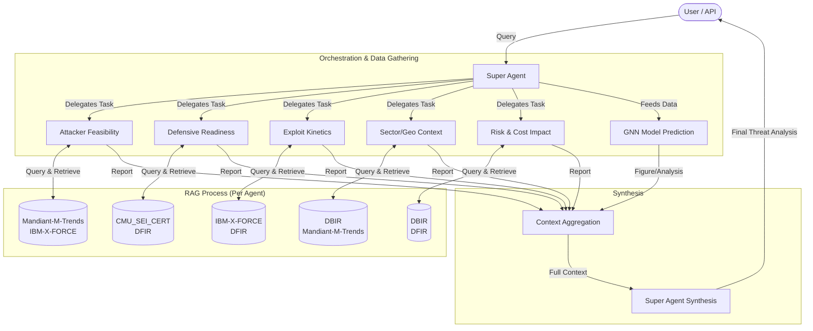

# Agent Architecture & Flow

This document details the multi-agent architecture of the Cyber Security RAG System.

## Agent Descriptions

The system consists of **5 Specialized Research Agents** and **1 Super Agent**.

| Agent Name | ID | Role & Description | Knowledge Base(s) |
| :--- | :--- | :--- | :--- |
| **Attacker Feasibility** | `attacker_feasibility` | **Offensive Researcher**: Analyzes the technical feasibility of attacks, considering complexity and available exploits. | `Mandiant-M-Trends`, `IBM-X-FORCE` |
| **Defensive Readiness** | `defensive_readiness` | **Defensive Specialist**: Evaluates the organization's preparedness, security policies, and infrastructure logs. | `CMU_SEI_CERT`, `DFIR` |
| **Exploit Kinetics** | `exploit_kinetics` | **Threat Intel Analyst**: Tracks the speed and trends of how exploits are adopted in the wild. | `IBM-X-FORCE`, `DFIR` |
| **Sector/Geo Context** | `sector_geo_context` | **Geopolitical Analyst**: Assesses threats based on industry sector and geographical location. | `DBIR`, `Mandiant-M-Trends` |
| **Risk & Cost Impact** | `risk_cost_impact` | **Risk Assessor**: Estimates potential financial and operational impacts of successful attacks. | `DBIR`, `DFIR` |
| **Super Agent** | `super_agent` | **Synthesizer**: Orchestrates the process, collecting reports from all research agents and GNN predictions to generate a final comprehensive report. | *N/A (Uses Agent Reports)* |

## Agent Flow Diagram

The following Mermaid diagram illustrates the flow from a user query to the final synthesized report.

## Setup Note
Each agent is configured in `config.yaml` with specific instructions and mapped knowledge bases. The `doc/` directory structure must match these knowledge base names for correct ingestion.
