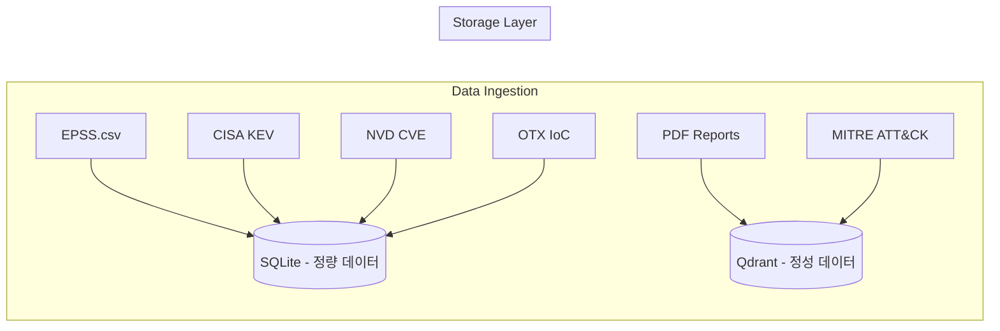

# Data Architecture

이 문서는 시스템에서 사용하는 데이터 소스와 저장 방식, 그리고 LLM에 컨텍스트를 제공하는 하이브리드 RAG 아키텍처를 설명합니다.

## 데이터 수집 경로

시스템은 다양한 사이버 보안 인텔리전스 소스로부터 데이터를 수집합니다.

| 소스 | 유형 | 설명 |
| :--- | :--- | :--- |
| **MITRE ATT&CK** | JSON | 공격 기법, 전술, 절차(TTP) 정보 |
| **CISA KEV** | JSON | 실제 악용이 확인된 취약점 목록 |
| **NVD (NIST)** | JSON | CVE 상세 정보 및 CVSS 점수 |
| **EPSS** | CSV | 취약점별 향후 30일 내 악용 확률 예측 |
| **AlienVault OTX** | JSON | IP, 도메인 등 침해 지표(IoC) |
| **PDF 보고서** | PDF | DBIR, Mandiant M-Trends, IBM X-Force 등 |

## 이중 데이터베이스 아키텍처 (Dual DB)

수집된 데이터는 그 특성에 따라 두 가지 데이터베이스에 분리 저장됩니다.



### 1. 관계형 데이터베이스 (RDB: SQLite)
**목적**: 정확한 수치와 팩트 기반 메타데이터 저장

| 테이블 | 주요 컬럼 | 용도 |
| :--- | :--- | :--- |
| `epss` | `cve`, `epss_score`, `percentile` | 악용 확률 예측 |
| `cisa_kev` | `cve_id`, `date_added` | 실제 악용 여부 확인 |
| `nvd_meta` | `cve_id`, `cvss_score` | 취약점 심각도 |
| `otx_ioc` | `indicator`, `type`, `pulse_id` | 침해 지표 검색 |

### 2. 벡터 데이터베이스 (VDB: Qdrant)
**목적**: 자연어 설명, 긴 문서의 의미론적 검색

| 컬렉션 | 소스 | 용도 |
| :--- | :--- | :--- |
| `cyber_intel_full` | 전체 통합 | 범용 위협 검색 |
| `DBIR` | Verizon DBIR 보고서 | 산업/지역별 침해 통계 |
| `Mandiant-M-Trends` | Mandiant 보고서 | APT 그룹 활동 동향 |
| `DFIR` | 포렌식 보고서 | 사고 대응 사례 |

## LLM 컨텍스트 주입 방식 (Hybrid RAG)

에이전트가 위협을 분석할 때, 세 가지 소스의 컨텍스트가 프롬프트에 주입됩니다.

```text
┌──────────────────────────────────────────────────────────────┐
│ [Relational Metadata (Factual Metrics)]                      │  ← RDB
│ - CVE-2023-1234: EPSS=0.85, CVSS=9.8, CISA_KEV=true          │
├──────────────────────────────────────────────────────────────┤
│ [Visual Intelligence Context]                                │  ← VLM
│ GNN 그래프 분석: 위협 트렌드가 2025년부터 급격히 상승...        │
├──────────────────────────────────────────────────────────────┤
│ [Technical/Knowledge Context]                                │  ← VDB
│ -- Document 1 (Mandiant-M-Trends) --                         │
│ APT41은 금융 기관을 대상으로 한 피싱 캠페인을 지속적으로...     │
└──────────────────────────────────────────────────────────────┘
```

### 자동 CVE 감지 및 RDB 조회
`batch_analysis.go`에서 위협 명칭이나 검색된 문서에서 CVE ID를 정규표현식으로 자동 감지합니다.
감지된 CVE는 SQLite를 즉시 조회하여 EPSS 점수, CVSS 점수, CISA KEV 등록 여부를 가져와 프롬프트에 주입합니다.

## 데이터 수집 실행

```bash
# 전체 데이터 수집 (VDB + RDB)
go run cmd/ingest/main.go

# 벡터 DB 초기화 후 재수집
go run scripts/purge_vdb.go && go run cmd/ingest/main.go
```

## 관련 문서
- [agent.md](agent.md) - 에이전트 아키텍처
- [additional_data.md](additional_data.md) - 외부 데이터셋 다운로드 가이드
